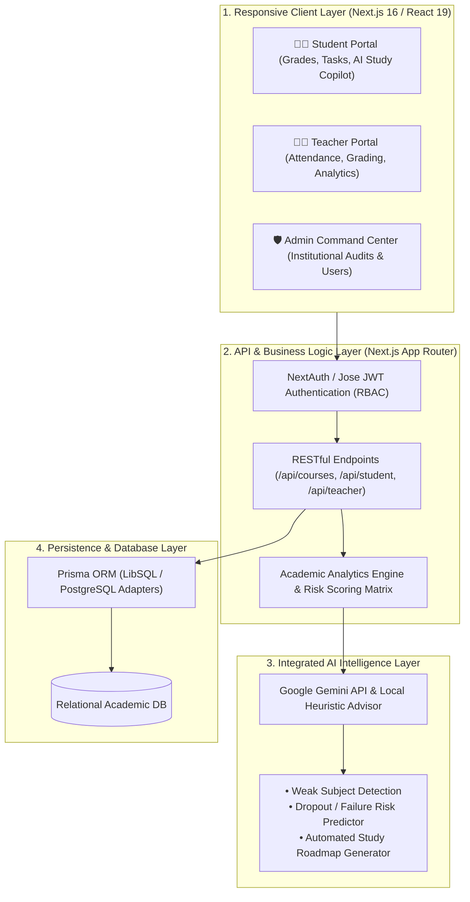

# 🎓 EduMind — AI-Powered Education Management Portal

[](https://nextjs.org/)
[](https://react.dev/)
[](https://www.typescriptlang.org/)
[](https://tailwindcss.com/)
[](https://www.prisma.io/)
[](LICENSE)

> **Track:** Web Development × Integrated Artificial Intelligence  
> **Live Demo:** [https://edumind-7.vercel.app/](https://edumind-7.vercel.app/)  
> **Repository:** [https://github.com/Sriman-7/Edumind](https://github.com/Sriman-7/Edumind)

---

## 🌟 Executive Summary

**EduMind** is an intelligent, full-stack Academic Operations & Student Analytics Portal engineered to bridge the gap between static academic records and proactive learning intelligence. 

Rather than functioning as a passive data silo, EduMind continuously correlates **attendance trends, assignment submissions, examination metrics, and classroom engagements** to compute real-time student risk factors, detect weak-subject patterns early, and generate personalized intervention recommendations for educators and advisors.

---

## 🔑 Demo Access Credentials

| Role | Email Address | Password | Permissions |
| :--- | :--- | :--- | :--- |
| 👨‍🎓 **Student** | `test@edumind.com` | `Test12345` | View personal courses, submit assignments, track grades & AI study plans |
| 👨‍🏫 **Teacher** | `teacher@edumind.com` | `Teacher12345` | Course authoring, assignment grading, attendance logging, class analytics |
| 🛡️ **Administrator** | `admin@edumind.com` | `Admin12345` | Institutional management, user provisioning, global analytics & AI reports |

---

## 🏛️ System Architecture



---

## ✨ Core Platform Highlights

### 1. 👨‍🎓 Student Intelligence Portal
- **Real-Time Academic Dashboard:** Unified GPA, attendance percentage, upcoming assignments, and examination schedule.
- **AI Academic Advisor:** Context-aware study assistant that identifies weak subject topics and generates personalized revision strategies.
- **Direct Assignment Submission:** Upload and track status of coursework with immediate teacher feedback.

### 2. 👨‍🏫 Teacher Command Center
- **Class Performance Analytics:** Visual distribution of student grades, attendance drop-off curves, and risk flags.
- **Streamlined Grading Hub:** Grade submissions with customized rubrics and instant student notification.
- **Attendance Logging:** One-click attendance sheets with automatic absence alerts sent to at-risk students.

### 3. 🛡️ Administrator Operations Center
- **Institutional Overview:** Total enrollment stats, faculty distribution, course capacities, and system audit logs.
- **Role-Based Access Control (RBAC):** Granular permission enforcement ensuring data privacy across departments.
- **Comprehensive Academic Reports:** Export institutional health summaries for accreditation and review.

---

## 🛠️ Technology Stack

| Domain | Technology | Purpose |
| :--- | :--- | :--- |
| **Frontend Framework** | **Next.js 16 (App Router)** | Server Components, Turbopack, Fast Navigation |
| **UI Library** | **React 19 & Tailwind CSS v4** | Modern responsive glassmorphism interface |
| **Language** | **TypeScript (Strict Mode)** | End-to-end type safety and maintainability |
| **Database & ORM** | **Prisma ORM & SQLite / LibSQL** | Schema migrations and relation queries |
| **Authentication** | **Jose & BCrypt.js** | Secure JWT session tokens and password hashing |
| **Artificial Intelligence** | **Google Gemini API (@google/genai)** | Student study roadmaps & risk analysis |
| **Icons & UI Utilities** | **Lucide React & CVA** | Accessible iconography and variant styling |

---

## 🚀 Quick Start (Local Setup)

### 1. Clone & Install
```bash
git clone https://github.com/Sriman-7/Edumind.git
cd Edumind
npm install
```

### 2. Configure Environment Variables
Create a `.env` file in the root directory:
```env
DATABASE_URL="file:./dev.db"
DIRECT_URL="file:./dev.db"
AUTH_SECRET="your-super-secret-jwt-key-here"
# Optional: Google Gemini API Key for live AI advisor features
GEMINI_API_KEY=""
```

### 3. Initialize Database & Seed
```bash
npx prisma db push
npx tsx prisma/seed.ts
```

### 4. Run Development Server
```bash
npm run dev
```

Open [http://localhost:3000](http://localhost:3000) to access EduMind.

---

## 📄 License & Attribution

Distributed under the **MIT License**. Created by Team **A.X.L** for the Grand Finale Buildathon.
